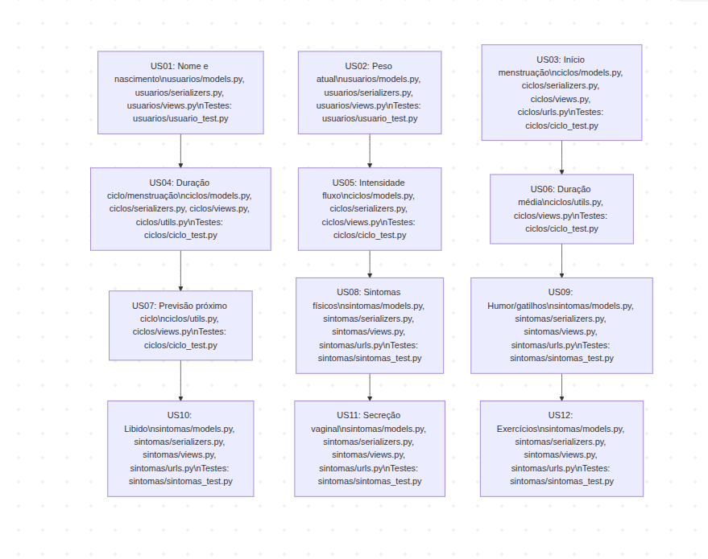

# Kanban de Backlog Associado a Arquivos

| Épico              | Feature                | ID    | História de Usuário                                                                                      | Implementação Principal                                                                 | Testes Relacionados                       |
|--------------------|------------------------|-------|-----------------------------------------------------------------------------------------------------------|----------------------------------------------------------------------------------------|-------------------------------------------|
| E01 Cadastro       | F01 Dados Pessoais     | US01  | Informar nome e data de nascimento                                 | usuarios/models.py, usuarios/serializers.py, usuarios/views.py                          | usuarios/usuario_test.py                  |
|                    |                        | US02  | Registrar peso atual                                               | usuarios/models.py, usuarios/serializers.py, usuarios/views.py                          | usuarios/usuario_test.py                  |
| E02 Ciclo          | F02 Menstruação        | US03  | Registrar início da menstruação                                    | ciclos/models.py, ciclos/serializers.py, ciclos/views.py, ciclos/urls.py                | ciclos/ciclo_test.py                      |
|                    |                        | US04  | Registrar duração do ciclo e menstruação                           | ciclos/models.py, ciclos/serializers.py, ciclos/views.py, ciclos/utils.py               | ciclos/ciclo_test.py                      |
|                    |                        | US05  | Informar intensidade do fluxo menstrual                            | ciclos/models.py, ciclos/serializers.py, ciclos/views.py                                | ciclos/ciclo_test.py                      |
|                    | F04 Cálculo de Duração | US06  | Ver duração média dos ciclos                                       | ciclos/utils.py, ciclos/views.py                                                       | ciclos/ciclo_test.py                      |
|                    | F05 Previsão de Próximo Ciclo | US07 | Previsão do próximo ciclo com base nos dados anteriores            | ciclos/utils.py, ciclos/views.py                                                       | ciclos/ciclo_test.py                      |
| E03 Sintomas       | F03 Sintomas Físicos   | US08  | Registrar sintomas físicos (cólicas, dores)                        | sintomas/models.py, sintomas/serializers.py, sintomas/views.py, sintomas/urls.py        | sintomas/sintomas_test.py                 |
|                    | F04 Sintomas Emocionais| US09  | Registrar variações de humor e gatilhos                            | sintomas/models.py, sintomas/serializers.py, sintomas/views.py, sintomas/urls.py        | sintomas/sintomas_test.py                 |
|                    | F05 Libido             | US10  | Registrar alterações na libido                                     | sintomas/models.py, sintomas/serializers.py, sintomas/views.py, sintomas/urls.py        | sintomas/sintomas_test.py                 |
|                    | F06 Secreção Vaginal   | US11  | Registrar secreções vaginais                                       | sintomas/models.py, sintomas/serializers.py, sintomas/views.py, sintomas/urls.py        | sintomas/sintomas_test.py                 |
| E04 Atividades     | F07 Exercícios         | US12  | Registrar prática de atividades físicas                            | sintomas/models.py, sintomas/serializers.py, sintomas/views.py, sintomas/urls.py        | sintomas/sintomas_test.py                 |

> **Observação:**
> - Os arquivos de implementação incluem models, serializers, views e utils diretamente relacionados à feature.
> - Os arquivos de teste estão na mesma pasta do domínio correspondente.
> - Para detalhes de endpoints e integrações, veja também os arquivos de urls.py de cada app. 

---

 